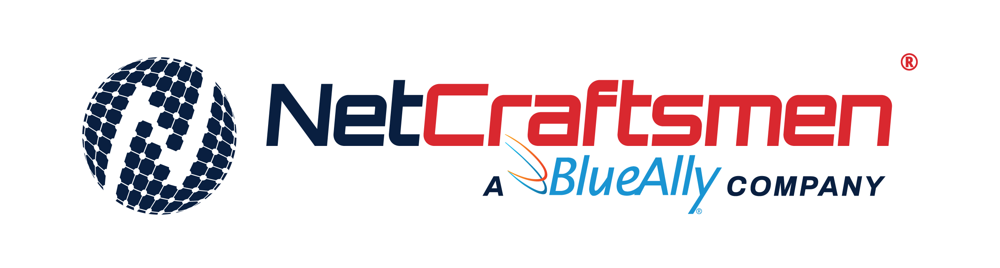

# introduction

At NetCraftsmen, we understand that as the technology solution provider for your organization, you need to ensure your infrastructure can enable and support your business’ goals. Because IT is complex, evolves rapidly and there are so many options to consider, it can be hard to do this alone.

For more than 20 years, clients with complex problems in highly regulated industries have trusted NetCraftsmen’s best-in-class experts to guide them in developing a technology strategy that delivers business results.

[Learn more](https://netcraftsmen.com/about-us/)

